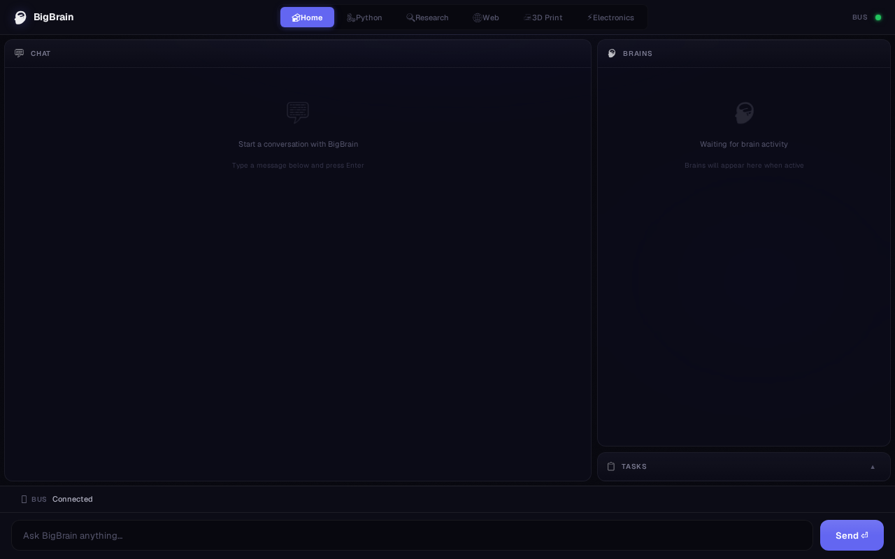
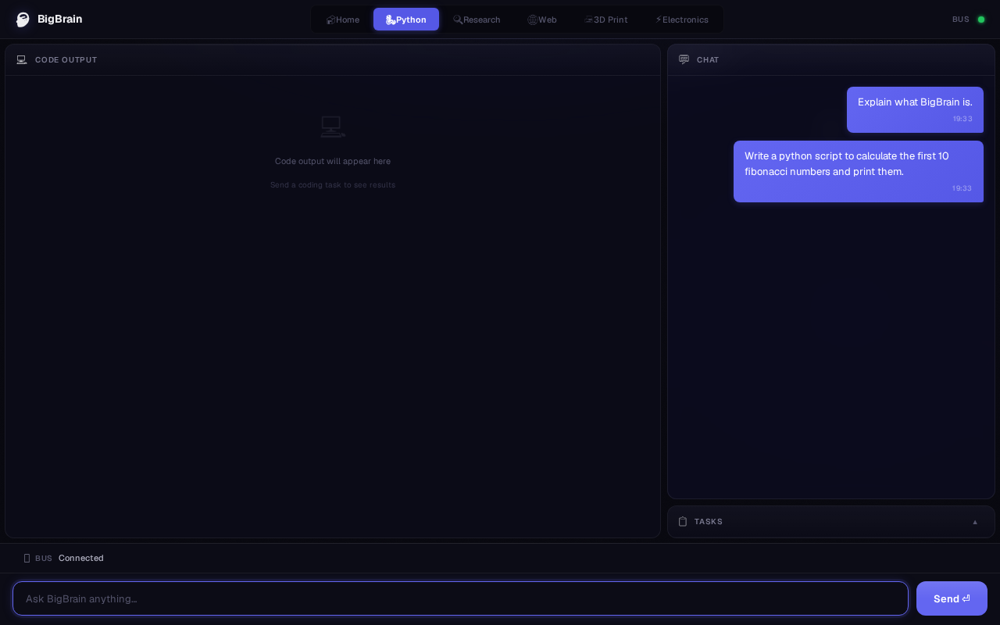

# BigBrain

**BigBrain** is a professional, multi-brain AI agent system featuring a CAN bus–inspired message architecture, specialized brains, and rigorous adversarial verification. Designed for scalability and high-confidence AI operations, BigBrain empowers developers to orchestrate complex tasks efficiently.

## Architecture

BigBrain uses a highly robust architecture separating intent, planning, execution, and verification.

```text
+----------------+      +----------------+      +-------------------+
|                |      |                |      |                   |
|  Front Brain   |----->|  Orchestrator  |----->|  Sub-brain Pool   |
|                |      |  (Event Bus)   |      |  (Python/TS/etc)  |
|                |      |                |      |                   |
+----------------+      +--------+-------+      +-------------------+
                                 |
                        +--------+--------+
                        |                 |
                        v                 v
                 +------------+     +-----------+
                 |            |     |           |
                 | TestWriter |     | Architect |
                 |            |     |           |
                 +------------+     +-----------+
```

### Verification Hierarchy

1. **Deterministic Tools (V4/V1)**: Ground truth validation
2. **LLM Opinions (V3)**: Advisory guidance
3. **Human Intervention (V5)**: Tiebreaker

See `docs/architecture.md` for full specification.

## Core Capabilities

- **Execution Modes**:
  - `SIMPLE`: Quick scripts, no tests.
  - `TESTED`: Self-verified with pytest.
  - `DAG`: Full multi-brain adversarial pipeline.
  - `AUTO`: LLM classification with fallback.
- **TestWriter Brain**: Adversarial test generation isolated from implementation logic.
- **AST-Based Attribution**: 3-tier failing file identification.
- **Diff History**: Previous attempts are tracked in fix prompts.
- **Robust Pipeline**: Skeleton-first code generation, dependency graphs via Kahn's topological sort, and cross-file AST linting.

## User Interface

BigBrain provides a morphable web interface that adapts to the current workspace and focus area.

### Home Workspace (Chat Response)


### Python Workspace (Workers Running)


### Python Workspace (Result Landed)


## Supported Models

BigBrain is fully integrated with **OpenRouter**, allowing you to use any cutting-edge LLM supported by their platform. You can configure which models handle different tasks by modifying your `.env` file:

- **Front Brain (Intent & Chat)**: Handles fast, low-latency intent parsing and conversational responses.
- **Python Brain (Worker)**: Handles complex reasoning, coding, and multi-step execution.

## Getting Started

### Installation

```bash
python3 -m venv .venv
source .venv/bin/activate
pip install -e ".[dev]"
```

### Configuration

Copy the `.env.example` to `.env` and add your OpenRouter API key along with your preferred model identifiers:

```bash
cp .env.example .env
```

**`.env` Configuration:**
```env
OPENROUTER_API_KEY=sk-or-your-key-here

# For the front brain (e.g. OpenAI GPT-4o Mini or DeepSeek Chat):
BIGBRAIN_MODEL_FRONT="openai/gpt-4o-mini"
# For the python worker (e.g. OpenAI GPT-4o or Anthropic Claude 3.5 Sonnet):
BIGBRAIN_MODEL_WORKER="openai/gpt-4o"
```

### Running the Server

```bash
python start_server.py
```

### Running Tests

```bash
pytest tests/ -v
```